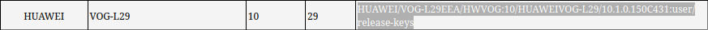

# DigFortitude

## Prompt

*The Digital Forensic team of Belgian Defence has acquired a phone of a target and made an image of its file system.
Knowing that the phone is running Android, can you answer the following questions:*

### Answers

- On which Wi-Fi network (SSID) did the phone connect? \
`SSID = 'Starbucks'`
- What was the password to this network? \
`Password = 'Starbucks Cofee'`
- What is the OS version (extra credit for the build version)? \
`OS = Android 10` \
`Build Version = 10.1.0.150C431`
- What is the timestamp the phone was last booted? \
`Thursday, April 18, 2024 2:51:31 PM GMT+02:00 DST`
- What is the MAC address of the Bluetooth adapter? \
`Address = 08:f4:58:83:b0:cb`

# Methodology

Being that I am unfamiliar to the android folder hierarchy I decided to read up on it a bit and a few folders came up quite often.\
These were:
- System
- Data
- Misc\
*Source: hxxps[://]www[.]androidauthority[.]com/phone-storage-folders-explained-744100/*

Upon first impression I noticed that the system had 3K+ files so it was obvious to me that I was not gonna be able to manually search through files without narrowing down the most interesting areas.

### Tools

I settled on using [yazi](https://github.com/sxyazi/yazi) for navigation and [ripgrep](https://github.com/BurntSushi/ripgrep) to "automate" the search of specific data inside files.

## Process

- ### Network

A simple `rg -i SSID` command gave me a lot of results but a particular file caught my insterest because it was in a `wifi` folder. \
**Output:**
```
data/misc/wifi/WifiConfigStore.xml
8:<string name="SSID">&quot;Starbucks&quot;</string>
9:<null name="BSSID" />
13:<boolean name="HiddenSSID" value="false" />
```
By opening that file we can also find the PreShared Key aka the password on line 10.\
`10:<string name="PreSharedKey">&quot;Starbucks Coffee&quot;</string>`

- ### Boot

`rg -i boot` got me quite a lot of results so it was a bit tedious but a few files stood out.\
**Output:**
```
data/data/com.huawei.android.hwouc/shared_prefs/com.huawei.android.hwouc_preferences.xml
31:    <boolean name="is_reboot_command" value="false" />
46:    <long name="T1_FIRST_BOOT_OR_UPDATE_SUCCESS_OR_FAIL_TIME" value="1711115369120" />
49:    <boolean name="REBOOT_UPGRADE_ALARM_FROM" value="false" />
82:    <long name="FIRST_BOOT_TIME_FOR_PSI" value="1711115368687" />

data/system/dropbox/SYSTEM_BOOT@1713444691000.txt
5:Bootloader: unknown
```
These long integer values were intruiging so I asked ChatGPT what they were.
He told me that they we unix epoch timestamps, so I found a converter to have it render a regular date and time.

Now that I knew what unix time was I could see that the boots in the first file were done earlier than the second so it would only make sense that they weren't the last boot.

The second literally says system boot at x so after converting that time I knew when the last boot was.

- ### OS Version

In the system boot file I saw the `Build:` so I simply put that string in a google search and I came to find this website: hxxp[://]atranalyzer[.]scdroid[.]com
\
Which only confirmed the Android (Build) version.

- ### Bluetooth

Why complicate when we've already got the right method?\
I used the same principle that I applied for the network part.

Simple `rg -i adapter` command gave me just what I needed.\
**Output:**
```
data/misc/bluedroid/bt_config.conf
8:[Adapter]
```
This looked like the typical syntax for a tag in a .conf file, so I investigated and there it was.
