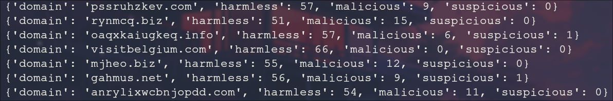
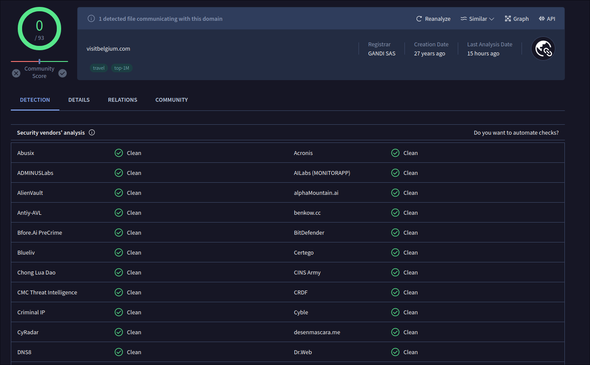

# Benign or hostile

## The answer

`visitbelgium.com`

## My first plan and how it failed

At first I wanted to use something like virustotal's API but unfortunately the rate limits prevented that, since the list had 100,000+ domains to check.

## My second plan and how it failed

I then tried to think outside the box and see if maybe I could use the top 1000 visited websites. Since they're the most visited they most likely aren't that hostile but that didn't work either none of the top 1000 websites appeared in the list, but it was worth a try. I even tried a quick search of `.be` domains as it would reduce the sample size considerably, but alas I found nothing.

## My third and final plan

As I stared into the void, devoid of ideas I realized something. These domains are gibberish are they even real?

So I sent a GET request to the first one and got a 404 :O

That's when I realized I could probably retry the first plan If I considerably reduced the sample size.

So I made a script to check server responses, If I got a 200 I added it to a file for later analysis. If not I wasn't gonna bother with it at all.

So there it was, a sample size reduced to ~400 domains. This was much easier to work with, unfortunately the API only allowed 4 requests per minute, so I decided to let this script run on a separate machine while I tackled other challenges since I knew it was gonna take a couple of hours.

Now that the new file was generated all I had to do was `/'malicious': 0` in vim to find my potential safe domains.

Some output from my script so you can see what I worked with ;)

As you can see this is obviously the safe domain, just to make sure I checked on virustotal.com and this is what it looked like:

Pretty benign if you ask me. Another worthy candidate that also had 0 warnings to it was imgnet.com but that's just because nobody knows the website so it hasn't been reviewed + I visited it and I can thank my adblocker for not showing me all the mess they had ready for me!
