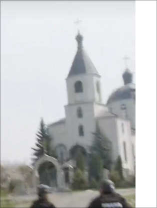
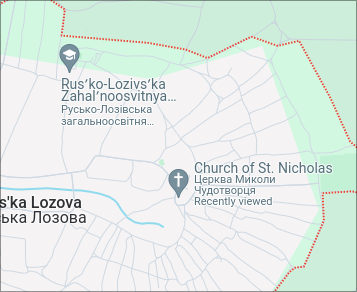
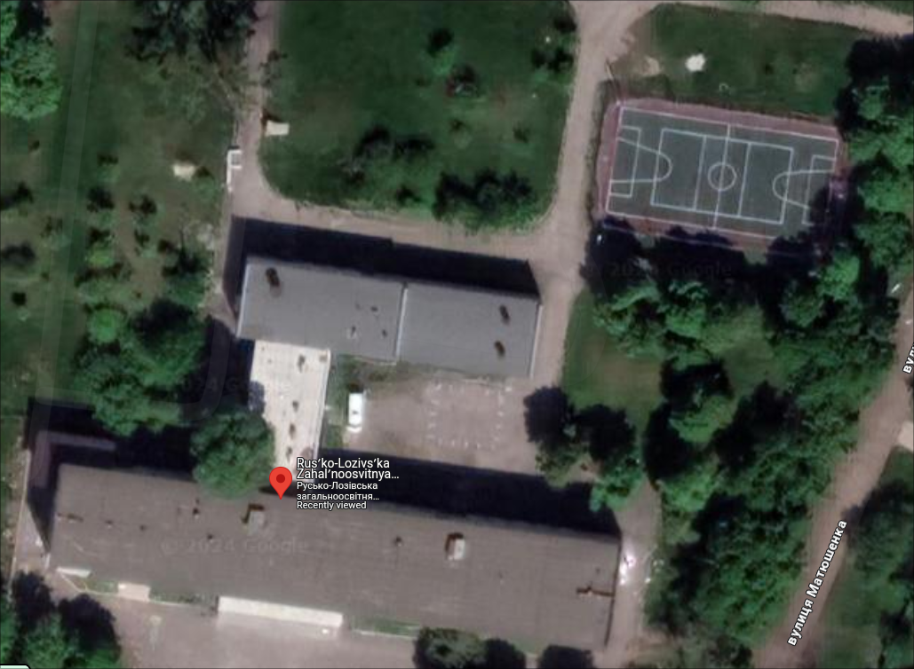

# Oops, I Leaked it again

## Answer

Coordinates = `50.14701317781418, 36.28282308341771`

## Process

Since they parked the car at `00:10` and were seen close to the Church of St. Nicholas `00:21` I assumed the POI wouldn't have been too far since from that point on they only traveled by foot and they also mention in the video that they can't stay anywhere for too long. So that gave me enough hints to start the search.

It was easy to figure out in what area they working in since they mentioned and "showed" most of the establishments in the village.

As soon as I saw the church I ran a reverse image search on google and it found it easily in the village of Rus'ka Lozova, I then looked for the hospital they mentioned just to confirm it was actually the place and there it was.

The image I searched with:

On google maps when you type Rus'ka Lozova you get these two establishments that are awfully close to each other, so I had to investigate.

The entry to the school is identical to the military HQ.
Just to confirm I cross-referenced with the basketball court right behind the school that is "shown" at `01:32`.

And there it was:

## End notes

A few months ago I'd heard about troops being found as they were stationed in a school because they were posting pictures on instagram. Maybe I kept that in the back of my mind and now schools in times of war are automatically a POI in my head.
